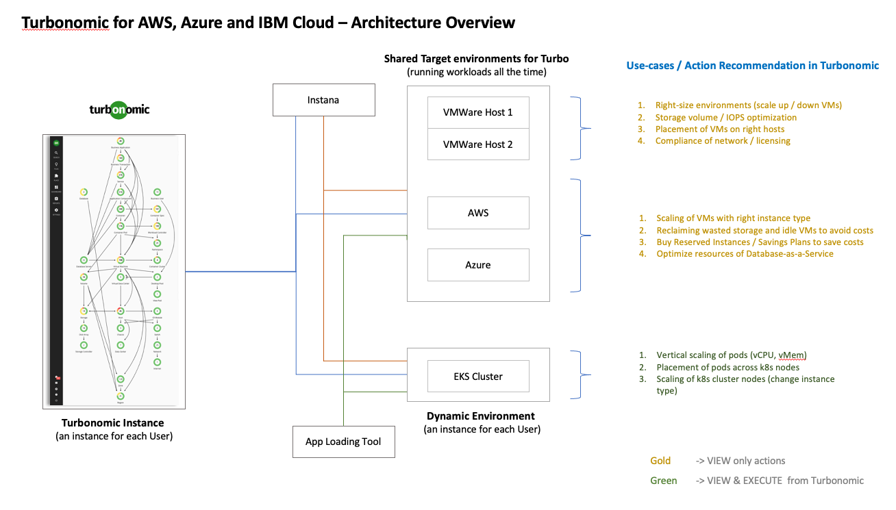

# Turbonomic for AWS, Azure and IBM Cloud - Terraform Automation

### Change Log

- **03/2022** - Initial Release

> This collection of Turbonomic IBM Cloud terraform automation bundles has been crafted from a set of  [Terraform modules](https://modules.cloudnativetoolkit.dev/) created by the IBM Ecosystem Labs team part of the [IBM Ecosystem organization](https://www.ibm.com/partnerworld/public?mhsrc=ibmsearch_a&mhq=partnerworld). Please contact **Matthew Perrins** _mjperrin@us.ibm.com_, **Vijay Sukthankar** _vksuktha@in.ibm.com_, **Sean Sundberg** _seansund@us.ibm.com_, **Tom Skill** _tskill@us.ibm.com_,  or **Andrew Trice** _amtrice@us.ibm.com_ for more details or raise an issue on the repository.

The automation will support the installation of Turbonomic on three cloud platforms (AWS, Azure and IBM Cloud).

### Target Infrastructure 

The Turbonomic automation assumes you have an OpenShift cluster already configured on your cloud of choice. The supported managed options are [ROSA for AWS](https://aws.amazon.com/rosa/), [ARO for Azure](https://azure.microsoft.com/en-us/services/openshift/) or [ROKS for IBM Cloud ](https://www.ibm.com/cloud/openshift).

Before you start to install and configure Turbonomic you need to identify what your target infrastructure is going to be. You can start from scratch and use one of the predefined reference architectures from IBM or bring you own.  


### Reference Architectures

The reference architectures are provided in three different forms, with increasing security and associated sophistication to support production configuration. These three forms are:

- **Quick Start** - a simple architecture to quickly get an OpenShift cluster provisioned
- **Standard** - a standard production deployment environment with typical security protections, private endpoints, VPN server, key management encryption, etc
- **Advanced** - a more advanced deployment that employs network isolation to securely route traffic between the different layers.

For each of these reference architecture, we have provided a detailed set of automation to create the environment for the software. If you do not have an OpenShift environment provisioned please use one of these. They are optimised for the installation of this solution.

| Cloud Platform                                                 | Automation and Documentation                                                                                                                                                                                  |   
|----------------------------------------------------------------|---------------------------------------------------------------------------------------------------------------------------------------------------------------------------------------------------------------|
| [IBM Cloud](https://cloud.ibm.com)                             | [IBM Cloud Quick Start](https://github.com/IBM/automation-ibmcloud-infra-openshift/tree/initial-version) </br> [IBM Cloud Standard](https://github.com/IBM/automation-ibmcloud-infra-openshift/tree/standard) |  
| [AWS](https://aws.amazon.com/)                                 | [AWS Quick Start](https://github.com/IBM/automation-aws-infra-openshift/tree/1-quick-start) </br> [AWS Standard - Coming soon]()                                                                              |
| [Azure](https://portal.azure.com/#home)                        | [Azure Quick Start- Coming soon]()                                                                                                                                                                            |                                                   
| Bring You Own Infrastructure | You will need to setup GitOps and Storage details on these steps below  | 

### Getting Started

Within this repository you will find a set of Terraform template bundles that embody best practices for provisioning Turbonomic in multiple cloud environments. This `README.md` describes the SRE steps required to provision the software. 

This suite of automation can be used for a Proof of Technology environment, or used as a foundation for production workloads with a fully working end-to-end cloud-native environment. 


## Turbonomic Architecture

The following reference architecture represents the logical view of how Turbonomic works after its is installed. After you have obtained a license key you will need to register you data sources. They can range from other Kubernetes environments to VMWare and Virtual Machines. 



Automation is provided in following Terraform bundles. You need to decide which cloud platform you are targeting for your installation. The bundles have been created this way to give the SRE team the most flexibility possible when building infrastructure for a project.

## Deploying Turbonomic


### Obtaining License Key

For PoC/PoTs, Partners download packages from PW. They search and get “M04TYENIBM Turbonomic Application Resource Management On-Prem 8.4.3 for install on Kubernetes English”, This package contains license file for Turbonomic, with name similar to “CP4MCM_IBM_ARM_OEM_Premier_License_July_2022.lic” “Turbonomic ARM P/N are currently available under IBM PPA terms and conditions”.


05:19
Attaching a lic file
05:20
Binary

CP4MCM_IBM_ARM_OEM_Premier_License_July_2022.lic
BinaryDownload Binary


VIJAY SUKTHANKAR  05:37
For a real sale, we got this response from Turbonomic team,  “licenses are provided by the finance team on signing a deal or by the SE mgmt if it is part of a PoV that has been approved”

### Cloud Infrastructure 


### Configuring GitOps


### Cloning Automation Repository

Clone this repository to access the automation to provision this reference architecture on the IBM Cloud. This repo contains the following defined _Bill of Materials_ or **BOMS** for short. They logically build up to deliver a set of IBM Cloud best practices. The reason for having them separate at this stage is to enable a layered approach to success. This enables SREs to use them in logical blocks. One set for Shared Services for a collection of **Edge**, **Management** and **Workload** VPCs or a number of **Workload** VPCs that maybe installed in separate regions.

### Turbonomic for Multi Cloud

| BOM ID | Name                                                                    | Description                                                                                                                                                                                                                                   | Run Time |
|--------|-------------------------------------------------------------------------|-----------------------------------------------------------------------------------------------------------------------------------------------------------------------------------------------------------------------------------------------|----------|
| 200    | [200 - ArgoCD BootStrap](./200-argocd-bootstrap)                        | Set up OpenShift GitOps in ROSA, ARO or ROKS, this is required to install the software using gitops only use this if you are bringing your own OpenShift Cluster which has not been provisioned from the reference architectures listed above | 15 Mins  |
| 202    | [202 - IBM Cloud Storage](./202-ibmcloud-storage-class)                 | If you are installing into your own ROKS clusters on IBM Cloud you will need to use this automation bundle to configure IBM Cloud Storage before installing Turbonomic                                                                        | 15 Mins  |
| 400    | [110 - Turbonomic Multi Cloud](./400-turbonomic-multicloud) | Provision Turbonomic into Multi Cloud environment AWS, Azure and IBM Cloud supported                                                                                                                                                          | 10 Mins  |


### Configuration guidance

There are a couple of things to keep in mind when preparing to deploy the architectures that will impact the naming conventions:

#### Creating multiple Management or Workload deployments

If you are planning to create multiple instances of the Management or Workload architecture in the same account, the following must be accounted for:

- Each deployment should use different values for `name_prefix` to keep the resources isolated

## Prerequisites

1. Have access to an IBM Cloud Account, Enterprise account is best for workload isolation but if you only have a Pay Go account this set of terraform can be run in that level of account.

2. Download OpenVPN Client from https://openvpn.net/vpn-server-resources/connecting-to-access-server-with-macos/#installing-a-client-application for your client device, this has been tested on MacOS

3. At this time the most reliable way of running this automation is with Terraform in your local machine either through a bootstrapped docker image or with native tools installed. We provide a Container image that has all the common SRE tools installed. [CLI Tools Image,](https://quay.io/repository/ibmgaragecloud/cli-tools?tab=tags) [Source Code for CLI Tools](https://github.com/cloud-native-toolkit/image-cli-tools)


## Setup


# Software Everywhere Turbonomics BEGINNER Set-Up Tutorial


Hello! Welcome to Caroline Ehler's documentation/tutorial I've compiled for the Software Everywhere project!
This tutorial is specific to Turbonomic.

**Contact**

Should there be any issues with this tutorial, please contact caroline.ehler@ibm.com. Thanks!

## Tutorial
### Set-Up
To begin, you'll need to be sure to have all of these things installed on your machine: Docker & Node.js

If you don't, follow these steps:

A. Download Homebrew: https://sourabhbajaj.com/mac-setup/Homebrew/
Follow the Homebrew setup tutorial.

B. Download Homebrew's Node.js: https://sourabhbajaj.com/mac-setup/Node.js/

C. Download Homebrew's Docker: https://sourabhbajaj.com/mac-setup/Docker/

From the Homebrew tutorial:

Docker for Mac can be downloaded here: https://docs.docker.com/desktop/mac/install/
```bash
brew install cask
brew install --cask docker
```

### Begin Tutorial
1. Create a cluster on Red Hat Openshift using IBM Cloud. https://cloud.ibm.com/


2. Clone the iascable repo here: https://github.com/cloud-native-toolkit/iascable
```bash
git clone https://github.com/cloud-native-toolkit/iascable.git
```

3. Inside the iascable directory, install node.js
```bash 
npm install
```

4. Create a Bill of Materials (BOM) called ```gitopsbootstrap-bom.yaml``` in iascalbe.

```python
apiVersion: cloud.ibm.com/v1alpha1
kind: BillOfMaterial
metadata:
  name: multicloud-cluster
spec:
  modules:
    - name: ocp-login
    - name: olm
    - name: gitops-namespace
    - name: argocd-bootstrap
    - name: gitops-console-link-job
    - name: gitops-cluster-config
      alias: config
      variables:
        - name: banner_text
          important: true
  ```

5. Run the BOM to generate the terraform file:

./iascable build -i <location_of_gitopsbootstrap-bom.yaml_file> -o <location_for_output>
```bash 
./iascable build -i gitopsbootstrap-bom.yaml -o ./myFolder
```

6. Accessing the generated folder from the above command, cd into myFolder --> multicloud-cluster --> terraform

7. Edit the file ```multicloud-cluster.auto.tfvars```. Uncomment the last line of each section to add your modifications.

**7A.** Banner Text: The title of the top banner in the cluster

```config_banner_text="Turbonomics Tutorial"```

**7B.** Namespace Name = The value that should be used for the namespace

```namespace_name="gitops-tools"```

**7C.** Server URL: The url for the OpenShift api

```server_url="https://c100-e.us-east.containers.cloud.ibm.com:31361"```

To access this, go to the OpenShift console from your cluster.


Click the dropdown from your username.

Click "Copy login command".


Hit display token.

Use the URL that follows ```--server=``` from the Login with this Token ```oc login``` line.


**7D.** Cluster Login Token:

```cluster_login_token="sha256....."```

Following the same steps as above for the Server URL, go to the same page with your OpenShift token login.

Use the API token as the Cluster Login Token.
**NOTE: The Cluster Login Token will time-out after about an hour.** You will have to modify the terraform file again if you cannot get to step 9 within an hour of generating this Login Token.

**7E.** Gitops-repo_host: The host for the git repository. (Use github.com)

```gitops-repo_host="github.com"```

**7F.** Gitops-repo_type: The type of the hosted git repository (github or gitlab).

```gitops-repo_type="github"```

**7G.** Gitops-repo_org: The org/group where the git repository exists/will be provisioned. (Your Github username)

```gitops-repo_org="cee7zm"```

**7H.** Gitops-repo_repo: The short name of the repository (i.e. the part after the org/group name) (The name for the repo the terraform will generate. Be sure the name you choose is not one of your existing repositories already).

```gitops-repo_repo="my_turbo_repo"```

**7I.** Fitops-repo_username: The username of the user with access to the repository (your github username)

```gitops-repo_username="cee7zm"```

**7J.** Gitops-repo_token: The personal access token used to access the repository

```gitops-repo_token="...[your generated token]..."```

To access your Github-generated token, go to Github.com.

Login and select your profile menu.


Go to Settings --> Developer Settings (bottom of left-side menu list) --> Personal Access Tokens (again, bottom of left-side menu)

Generate a new token. **MAKE NOTE OF THIS TOKEN. IT WILL DISAPPEAR AFTER YOU VIEW IT.**

Select the permissions for the token to be at least the bolded repo and delete_repo boxes.

Hit Generate Token. MAKE NOTE OF THIS TOKEN. Hit the copy button and store it somewhere for future reference.


8. Open up Docker to run. In the terraform directory, run the following commands.

Set the environment variable GITTOKEN to your **generated Github token.**

```export GITTOKEN="3792a189....." ```

```docker run -it -e TF_VAR_gitops-repo_token=$GITTOKEN -v ${PWD}:/terraform -w /terraform quay.io/ibmgaragecloud/cli-tools:v0.15```

Terraform will begin running. Now run:

```$ terraform init``` This will take a minute to run.

```$ terraform apply -auto-approve```
This will take 10-15 minutes to compelte if this is your first-time running this setup.

10. Check to see if everything downloaded correctly and you can access Turbonomic.

**10A.** In the OpenShift Console, go to **Networking --> Routes**


**10B.** Verify thtat you are in the proper namespace you established earlier.


**10C.** Visit the location link to go to Turbonomic.


**10D.** You should be taken to the Turbonomic login page! If you made it here, congrats! You are finished with the tutorial. Go ahead and login, provide your license, and get started!


**Tutorial Complete. If you have any concerns, questions, or feedback, please email caroline.ehler@ibm.com. Thanks!**


### Terraform IasC Automation

1. Clone this repository to your local SRE laptop or into a secure terminal. Open a shell into the cloned directory.
2. Determine what type of deployment you will be doing. There are currently two template FLAVORS available:
   - `full`: Full IBM Cloud reference architecture deployment, including a Key Protect instance.
   - `small`: IBM reference architecture scaled down for a POC environment deployment. This includes Key Protect and the clusters have been reduced to single region.
3. Determine which reference architecture you will be deploying. There are currently two options available:
   - `vpc`: IBM Cloud - VPC with virtual servers reference architecture
   - `ocp`: IBM Cloud - VPC with Red Hat OpenShift reference architecture
   - `all`: Will copy all the terraform bundles into your workspace bundles prefixed `000` to `170`
4. Run the `setup-workspace.sh -t {FLAVOR} -a {ARCH}` script to create a copy of the Terraform scripts in a `workspace/` directory and generate the SSH keys needed for the various VSI instances.
   ```
   ./setup-workspace.sh -t small -a all
   ```
5. Update **terraform.tfvars** in the `workspace/` directory with the appropriate values for your deployment. Note: The values are currently set up to place everything in the same resource group. To use different resource groups, provide different values for each of the `*_resource_group_name` variables and comment out the `*_resource_group_provision="false"` values.

## Terraform Apply

### Set up credentials

1. Copy `credentials.template` to `credentials.properties`.
2. Provide your IBM Cloud API key as the value for the `ibmcloud.api.key` variable in `credentials.properties` (**Note:** `*.properties` has been added to `.gitignore` to ensure that the file containing the apikey cannot be checked into Git.)


# Software Everywhere Turbonomics BEGINNER Set-Up Tutorial


Hello! Welcome to Caroline Ehler's documentation/tutorial I've compiled for the Software Everywhere project!
This tutorial is specific to Turbonomic.

**Contact**

Should there be any issues with this tutorial, please contact caroline.ehler@ibm.com. Thanks!

## Tutorial
### Set-Up
To begin, you'll need to be sure to have all of these things installed on your machine: Docker & Node.js

If you don't, follow these steps:

A. Download Homebrew: https://sourabhbajaj.com/mac-setup/Homebrew/
Follow the Homebrew setup tutorial.

B. Download Homebrew's Node.js: https://sourabhbajaj.com/mac-setup/Node.js/

C. Download Homebrew's Docker: https://sourabhbajaj.com/mac-setup/Docker/

From the Homebrew tutorial:

Docker for Mac can be downloaded here: https://docs.docker.com/desktop/mac/install/
```bash
brew install cask
brew install --cask docker
```

### Begin Tutorial
1. Create a cluster on Red Hat Openshift using IBM Cloud. https://cloud.ibm.com/


2. Clone the iascable repo here: https://github.com/cloud-native-toolkit/iascable
```bash
git clone https://github.com/cloud-native-toolkit/iascable.git
```

3. Inside the iascable directory, install node.js
```bash 
npm install
```

4. Create a Bill of Materials (BOM) called ```gitopsbootstrap-bom.yaml``` in iascalbe.

```python
apiVersion: cloud.ibm.com/v1alpha1
kind: BillOfMaterial
metadata:
  name: multicloud-cluster
spec:
  modules:
    - name: ocp-login
    - name: olm
    - name: gitops-namespace
    - name: argocd-bootstrap
    - name: gitops-console-link-job
    - name: gitops-cluster-config
      alias: config
      variables:
        - name: banner_text
          important: true
  ```

5. Run the BOM to generate the terraform file:

./iascable build -i <location_of_gitopsbootstrap-bom.yaml_file> -o <location_for_output>
```bash 
./iascable build -i gitopsbootstrap-bom.yaml -o ./myFolder
```

6. Accessing the generated folder from the above command, cd into myFolder --> multicloud-cluster --> terraform

7. Edit the file ```multicloud-cluster.auto.tfvars```. Uncomment the last line of each section to add your modifications.

**7A.** Banner Text: The title of the top banner in the cluster

```config_banner_text="Turbonomics Tutorial"```

**7B.** Namespace Name = The value that should be used for the namespace

```namespace_name="gitops-tools"```

**7C.** Server URL: The url for the OpenShift api

```server_url="https://c100-e.us-east.containers.cloud.ibm.com:31361"```

To access this, go to the OpenShift console from your cluster.


Click the dropdown from your username.

Click "Copy login command".


Hit display token.

Use the URL that follows ```--server=``` from the Login with this Token ```oc login``` line.


**7D.** Cluster Login Token:

```cluster_login_token="sha256....."```

Following the same steps as above for the Server URL, go to the same page with your OpenShift token login.

Use the API token as the Cluster Login Token.
**NOTE: The Cluster Login Token will time-out after about an hour.** You will have to modify the terraform file again if you cannot get to step 9 within an hour of generating this Login Token.

**7E.** Gitops-repo_host: The host for the git repository. (Use github.com)

```gitops-repo_host="github.com"```

**7F.** Gitops-repo_type: The type of the hosted git repository (github or gitlab).

```gitops-repo_type="github"```

**7G.** Gitops-repo_org: The org/group where the git repository exists/will be provisioned. (Your Github username)

```gitops-repo_org="cee7zm"```

**7H.** Gitops-repo_repo: The short name of the repository (i.e. the part after the org/group name) (The name for the repo the terraform will generate. Be sure the name you choose is not one of your existing repositories already).

```gitops-repo_repo="my_turbo_repo"```

**7I.** Fitops-repo_username: The username of the user with access to the repository (your github username)

```gitops-repo_username="cee7zm"```

**7J.** Gitops-repo_token: The personal access token used to access the repository

```gitops-repo_token="...[your generated token]..."```

To access your Github-generated token, go to Github.com.

Login and select your profile menu.


Go to Settings --> Developer Settings (bottom of left-side menu list) --> Personal Access Tokens (again, bottom of left-side menu)

Generate a new token. **MAKE NOTE OF THIS TOKEN. IT WILL DISAPPEAR AFTER YOU VIEW IT.**

Select the permissions for the token to be at least the bolded repo and delete_repo boxes.

Hit Generate Token. MAKE NOTE OF THIS TOKEN. Hit the copy button and store it somewhere for future reference.


8. Open up Docker to run. In the terraform directory, run the following commands.

Set the environment variable GITTOKEN to your **generated Github token.**

```export GITTOKEN="3792a189....." ```

```docker run -it -e TF_VAR_gitops-repo_token=$GITTOKEN -v ${PWD}:/terraform -w /terraform quay.io/ibmgaragecloud/cli-tools:v0.15```

Terraform will begin running. Now run:

```$ terraform init``` This will take a minute to run.

```$ terraform apply -auto-approve```
This will take 10-15 minutes to compelte if this is your first-time running this setup.

10. Check to see if everything downloaded correctly and you can access Turbonomic.

**10A.** In the OpenShift Console, go to **Networking --> Routes**


**10B.** Verify thtat you are in the proper namespace you established earlier.


**10C.** Visit the location link to go to Turbonomic.


**10D.** You should be taken to the Turbonomic login page! If you made it here, congrats! You are finished with the tutorial. Go ahead and login, provide your license, and get started!


**Tutorial Complete. If you have any concerns, questions, or feedback, please email caroline.ehler@ibm.com. Thanks!**


### Apply each architecture in the solution

1. From the root of the cloned repository directory, run `./launch.sh`. This will start a docker container that contains the required libraries to run the terraform scripts.

   > This `launch.sh` currently has a dependency on Docker Desktop we are working on alternative solution.

2. The container should have opened in the `/terraform/workspace` as the working directory which should be mounted from repository directory on the host.
3. Change directory to the terraform directory that will be applied (e.g. `000-account-setup` and `100-common-services`)
4. Initialize the environment with `terraform init`
5. Apply the terraform with `terraform apply -auto-approve`. If all is configured properly you should not be prompted again and the terraform should run to completion.
6. It is recommended to run Terraform bundles in this order:
   - `000`
   - `110`
   - `130`
   - `150`
   - Connect to the VPN (see instructions below)
   - `160`
   - `165`

## Configurating Data Sources


## Summary


   

## Troubleshooting

There are currently no troubleshooting topics at this point. 

### How to Generate this repository from teh source Bill of Materials.

This set of automation packages was generated using the open-source [`isacable`](https://github.com/cloud-native-toolkit/iascable) tool. This tool enables a [Bill of Material yaml](https://github.com/cloud-native-toolkit/automation-solutions/tree/main/boms/software/turbonomic) file to describe your software requirements. If you want uppstream releases or versions you can use `iascable` to generate the terraform templates tyou require.

> The `iascable` tool is targeted for use by advanced SRE developers. It requires deep knowledge of how the modules plug together into a customized architecture. This repository is a fully tested output from that tool. This makes it ready to consume for projects.
